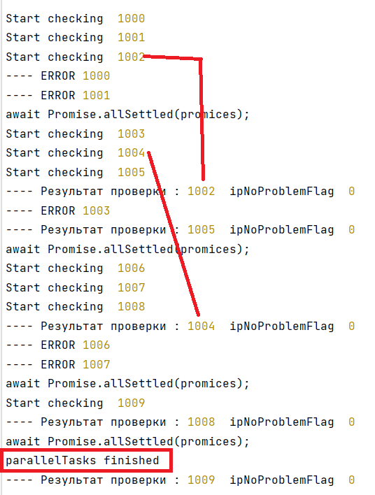

Помогите, пожалуйста, понять где я ошибся в коде.

В оригинале программа посылает http запросы к серверу параллельно.

Количество паралельно выполняющихся запросов указано в константе 
```const parallelCTX = 3;```

В константе ```const MaxData = 10;``` задано общее количество запросов, которое надо выполнить.

Запросы посылаются пачками размером parallelCTX, и потом их результат обрабатывается (выводится в консоль)

Я посылаю пачку запросов и потом жду их завершения c помощью ```await Promise.allSettled(promices);```

Результат выполнения программы:


Я ожидал что результат работы пачки запросов завершится до await Promise.allSettled
Но, как видно на рисунке некоторые запросы завершаются уже в следующих пачках.

И один запрос завершился уже после выхода из функции parallelTasks

В assets есть еще 2 примера работы.

Помогите, пожалуйста, понять почему так происходит и как поправить код, так, чтобы подождать пока завершиться пачка запросов и потом уже запускалась следующая и как дождаться полного завершения работы функции parallelTasks

P.S. результат работы как на картинке получается не на каждом прогоне программы
